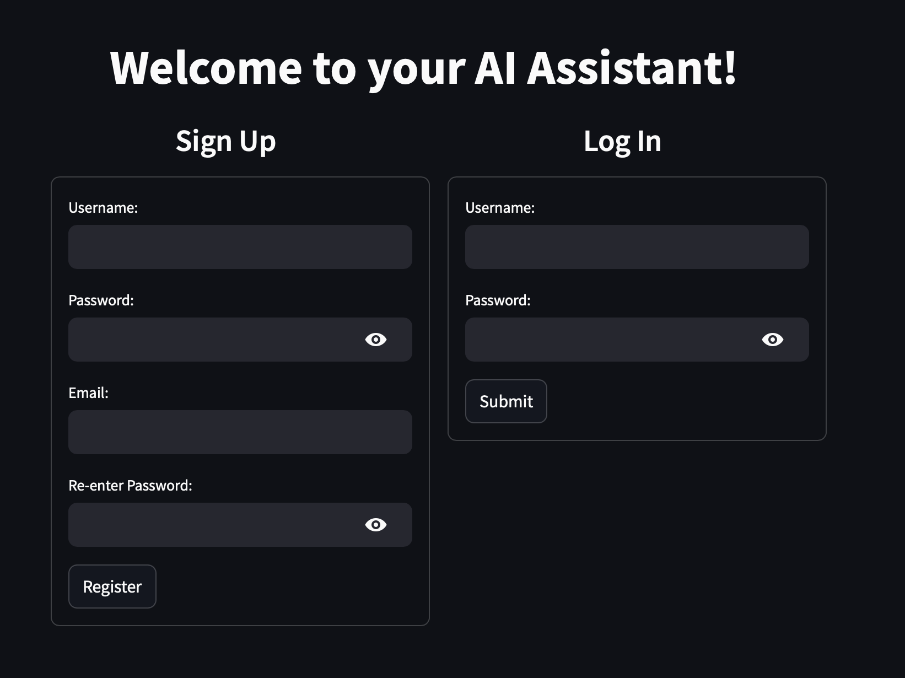
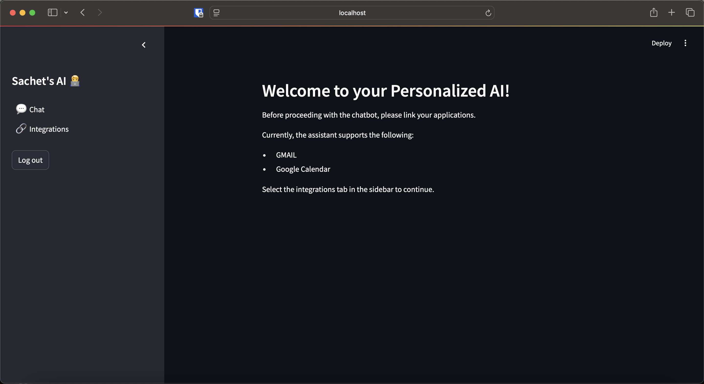
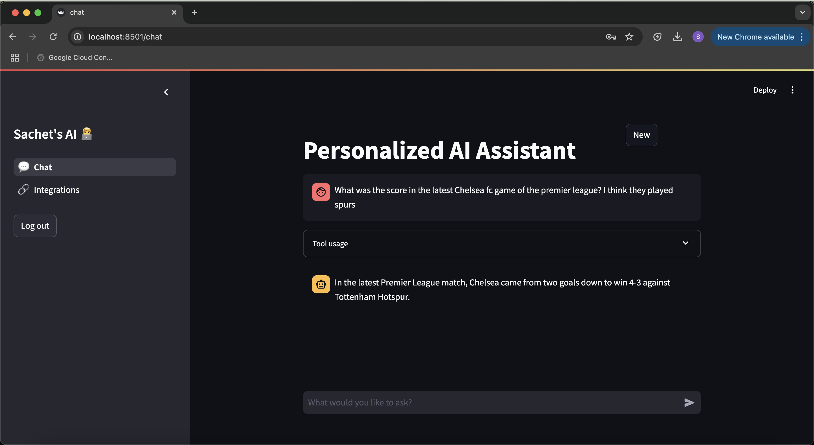
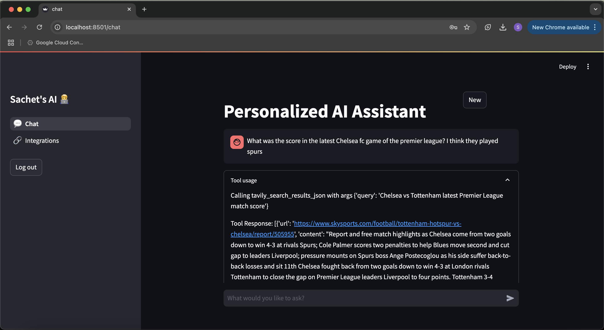
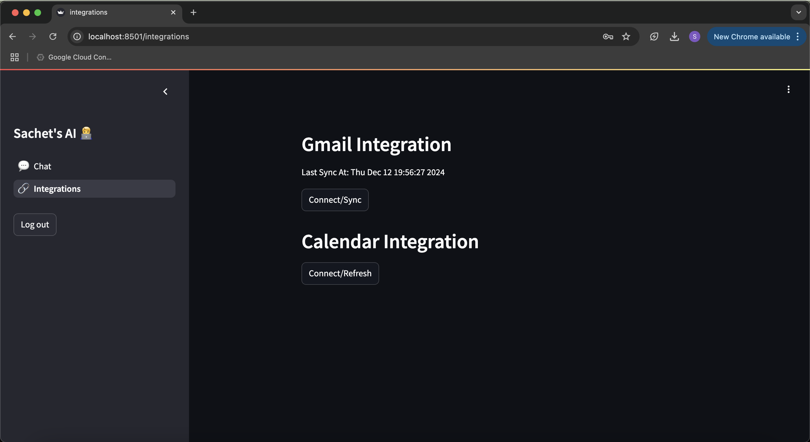
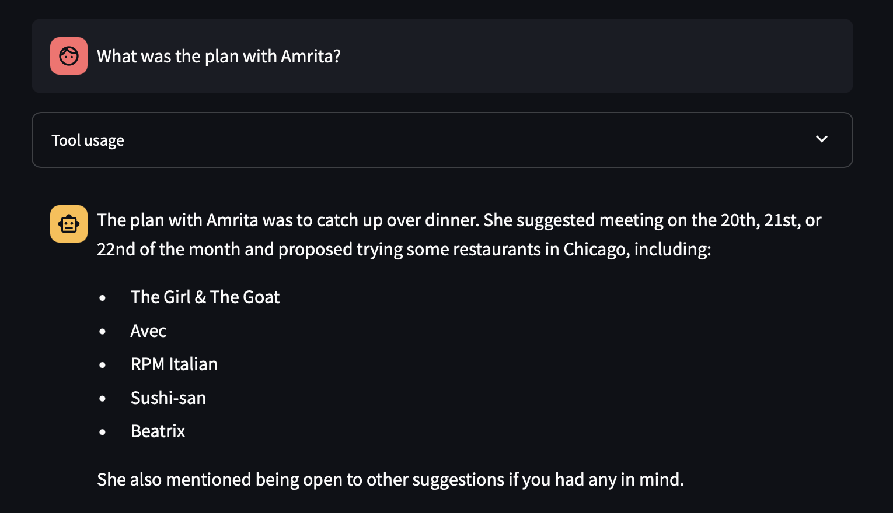
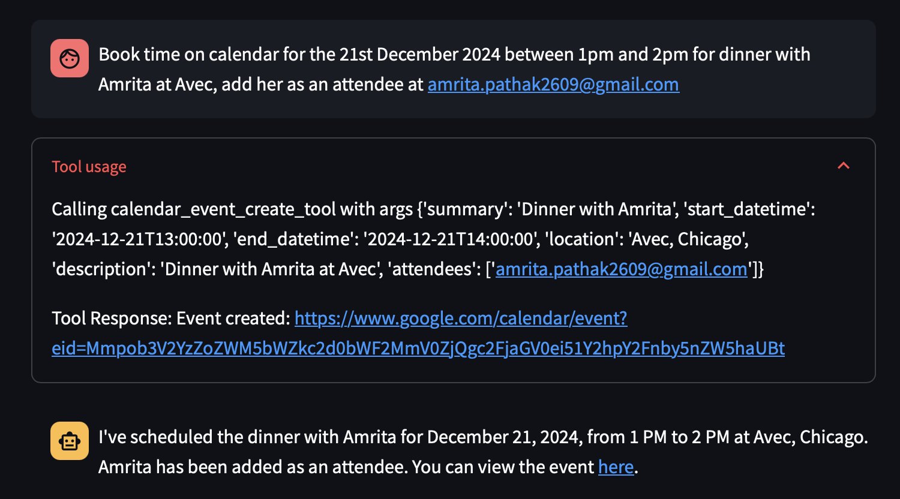
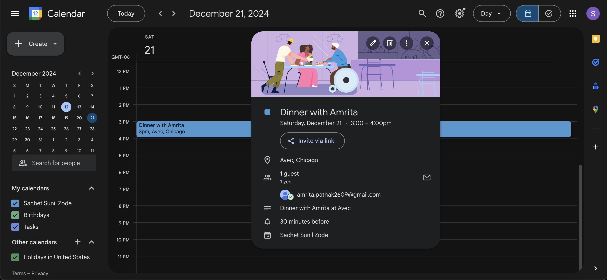
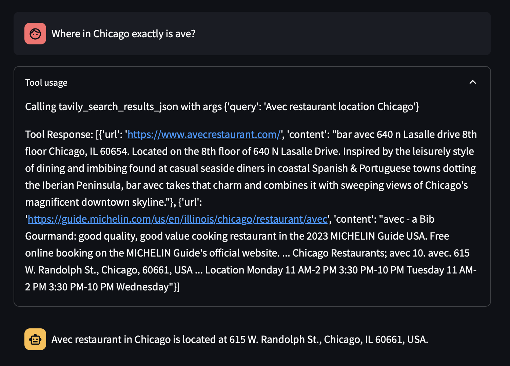

# Personalized AI Assistant

## Overview

This project aims to develop a robust, personalized AI assistant that integrates seamlessly with a user's personal data streams—such as emails, messages, calendar events, and reminders—and leverages external tools (e.g., web search, code execution) to function as an efficient, context-aware digital companion. By blending large language model (LLM) capabilities with retrieval-augmented generation (RAG), this system delivers highly relevant and timely information, all while maintaining a strong focus on user privacy and security.

## User Interface and Interactions

The application provides a clean and intuitive interface:

**Signup/Login and Home Pages**

From the home page, users can easily access their integrations, initiate chats, and manage their assistant’s settings.

**Chat Interface**

The chat view supports dynamic, context-aware conversations:

You can ask follow-up questions based on the conversation history. The interface also gives you insights into how the LLM interacts with integrated tools:

## Integrations Management

Integrations can be easily managed from a dedicated page, allowing users to securely connect their accounts and services.

**Integrations Page**

### Gmail Integration

By connecting your Gmail account, the assistant can fetch and synchronize your emails, embedding them into a vector database for easy retrieval and contextually relevant responses.

**Gmail Sync Process**

The assistant uses incremental sync via the Gmail API, storing the last sync timestamp in a SQL database. This ensures only new emails are fetched after each sync.

**Gmail Query Support**

With this integration, you can query the assistant about recent emails, attachments, and even details like the sender or subject line. Future enhancements will enable sending emails, tagging, and managing messages directly through the assistant.

### Google Calendar Integration

Seamlessly integrate your Google Calendar to create, view, and manage events using natural language commands.

**Event Creation Through the Application**

**Resulting Event in Google Calendar**

The assistant uses the Google Calendar API to add events, attendees, and locations. Future updates will expand capabilities to searching, modifying, and deleting events.

## Tools and Utilities

### Tavily Search Integration

The assistant incorporates the Tavily Search API for real-time web searches, enabling it to provide up-to-date information and news.

## Core Concepts and Technologies

1. **Retrieval Augmented Generation (RAG):**  
   The assistant offloads context retrieval to a vector database (Qdrant) using OpenAI’s `text-embedding-3-small` model for embeddings and dot-product similarity for efficient semantic search. RAG ensures the assistant can ground its responses in relevant, up-to-date content.

2. **Langgraph & Langsmith:**  
   Langgraph simplifies building chatbots and integrating them with various tools. Langsmith’s tracing features assist in debugging and improving the dialog flow.

3. **Streamlit Frontend:**  
   The frontend leverages Streamlit for rapid prototyping and integration. Its simplicity and compatibility with backend APIs enable quick iteration and feature expansion.

**Chatbot Design Graph**

The underlying graph ensures smooth interactions between the LLM and available tools. Prompts always pass through the LLM node, maintaining conversational consistency and context flow.

## Security and Responsible AI Considerations

- **Data Privacy:**  
  - All user credentials are hashed before storage to prevent unauthorized access.  
  - Qdrant’s per-user filtering ensures data isolation, so no user’s data can be accessed by another user.
  - Development currently stores some credential files on the backend for convenience; in production, credentials should be stored securely in the browser.

- **Responsible AI Use:**  
  Future plans include implementing fairness and bias mitigation strategies, along with content moderation and red-teaming to ensure safer, more equitable system behavior.

## Future Enhancements

1. **Additional Integrations:**  
   - Extend beyond Gmail and Google Calendar to integrate with other Google services (Tasks, Reminders, Meet), Microsoft suites (Outlook, 365), productivity tools (Notion, Evernote), and messaging platforms (Slack, Teams).

2. **Enhanced Features for Existing Integrations:**  
   - Gmail: Support sending, deleting, tagging, and chunking large emails.  
   - Calendar: Add search, deletion, and modification of events, along with intelligent reminders.

3. **Improved RAG Approach:**  
   - Incorporate query expansion, named entity recognition, and advanced indexing techniques for better retrieval accuracy.

4. **User Interface & Personalization:**  
   - Offer granular privacy controls, personalized dashboards, and more intuitive search filters.  
   - Over time, the assistant could learn user preferences, offering more tailored suggestions and insights.

5. **Operational and Developer-Focused Enhancements:**  
   - Add comprehensive documentation, tutorials, and examples.  
   - Incorporate testing frameworks (unit, integration, E2E) for reliability.  
   - Implement caching and load testing to ensure scalability and performance.

6. **Logging & Analytics:**  
   - Introduce usage analytics, monitoring, and advanced logging.  
   - Provide insights into how users interact with the assistant, guiding further improvements.

## Conclusion

This Personalized AI Assistant serves as a powerful platform for blending personal data, external tools, and LLM reasoning. It aims to improve productivity, streamline personal workflows, and deliver contextual information promptly and securely. With planned integrations, enhanced features, improved retrieval techniques, and a firm commitment to user privacy, this project sets a solid foundation for a next-generation digital companion.

Stay tuned for more updates, integrations, and continuous improvements as the project evolves.